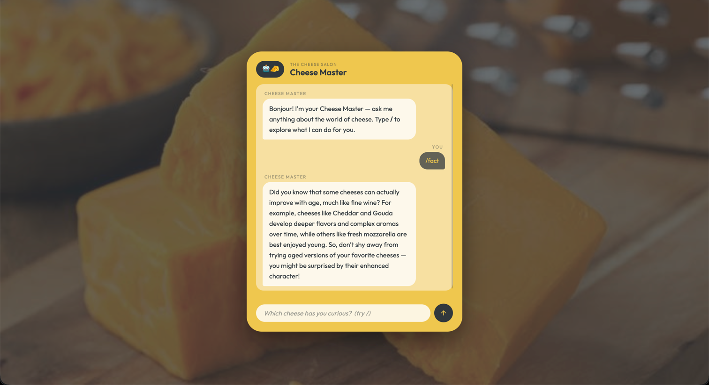

# Cheese Master

A beautiful AI-powered cheese chatbot with slash commands, a trivia quiz, a cheese selfie camera, and a cheddar takeover mode. Built with a FastAPI + AstraDB + OpenAI backend and a vanilla JS frontend deployed on GitHub Pages.

|  |  |
|-------------------------|---|

---

## What it does

Chat with the Cheese Master — a knowledgeable AI that answers questions about cheese using a vector database of curated cheese knowledge. Type `/` in the chat to unlock a full command menu:

| Command | Description |
|---|---|
| `/fact` | A surprising cheese fact |
| `/pair [cheese]` | Food & wine pairings |
| `/describe [cheese]` | Evocative tasting notes |
| `/origin [cheese]` | History & provenance |
| `/substitute [cheese]` | Alternatives when you're out |
| `/board` | A curated cheese board suggestion |
| `/season` | What's at peak right now |
| `/quiz` | 5-question trivia challenge with multiple choice |
| `/cheeseme` | Take a webcam selfie and get a cheese on your head |
| `/cheddar` | Watch cheddar drip down until it consumes everything |

---

## Tech stack

**Frontend**
- Vanilla HTML / CSS / JS — no framework, no build step
- Hosted on **GitHub Pages** (auto-deployed via GitHub Actions)
- Fonts: Cormorant Garamond + Outfit (Google Fonts)

**Backend**
- **FastAPI** — REST API with a single `/chat` endpoint
- **OpenAI** — `text-embedding-3-small` for vector search, `gpt-4o-mini` for answers
- **AstraDB** (DataStax) — serverless vector database storing cheese knowledge
- Hosted on **Render** (free tier)

---

## Project structure

```
langflow_cheese/
├── docs/                     # Static site (deployed to GitHub Pages)
│   ├── index.html            # All UI, slash commands, quiz, selfie, cheddar
│   ├── css/style.css
│   ├── js/
│   │   ├── index.js          # Sets random cheese background on load
│   │   ├── images.js         # Auto-generated list of cheese image paths
│   │   └── cheese_name_getter.js  # Node script to regenerate images.js
│   └── src/cheese/           # 65 cheese background images
│
├── cheese-backend/           # FastAPI app (deployed to Render)
│   ├── api.py                # /chat endpoint — embed → vector search → GPT answer
│   ├── ingest.py             # One-time script to load cheese data into AstraDB
│   ├── dataset/
│   │   ├── cheeses.csv
│   │   └── cheese_details.csv
│   ├── Procfile              # Render start command
│   ├── requirements.txt      # API dependencies only
│   └── requirements-scraper.txt  # Selenium deps for the image scraper
│
├── .github/workflows/
│   └── deploy-frontend.yml   # Auto-deploys cheese-frontend/ to GitHub Pages
├── .env.example              # Template — copy to .env and fill in values
└── docker/docker-compose.yml
```

---

## Local development

### 1. Clone the repo

```bash
git clone https://github.com/YOUR-USERNAME/langflow_cheese.git
cd langflow_cheese
```

### 2. Set up the backend

```bash
cd cheese-backend
python -m venv .venv
source .venv/bin/activate      # Windows: .venv\Scripts\activate
pip install -r requirements.txt
```

Copy the env template and fill in your credentials:

```bash
cp ../.env.example ../.env
# then edit .env with your real values
```

Start the API:

```bash
uvicorn api:app --reload
# running at http://localhost:8000
```

### 3. Run the frontend

The frontend is plain HTML — no build step needed. Open `docs/index.html` directly in a browser, or serve it with any static server:

```bash
cd docs
python -m http.server 5500
# open http://localhost:5500
```

### 4. Ingest cheese data (one-time)

If you're starting fresh or want to reload the vector database:

```bash
cd cheese-backend
python ingest.py --file dataset/cheeses.csv
python ingest.py --file dataset/cheese_details.csv
```

---

## Environment variables

Copy `.env.example` to `.env` and fill in:

| Variable | Required | Description |
|---|---|---|
| `OPENAI_API_KEY` | Yes | Your OpenAI API key |
| `ASTRA_DB_APPLICATION_TOKEN` | Yes | AstraDB application token |
| `ASTRA_DB_API_ENDPOINT` | Yes | AstraDB API endpoint URL |
| `ASTRA_DB_KEYSPACE` | No | Defaults to `cheese_db` |
| `ASTRA_DB_COLLECTION` | No | Defaults to `cheeses` |
| `OPENAI_MODEL` | No | Defaults to `gpt-4o-mini` |
| `EMBEDDING_MODEL` | No | Defaults to `text-embedding-3-small` |
| `ALLOWED_ORIGINS` | No | Comma-separated CORS origins. Set to your GitHub Pages URL in production. |

---

## Deployment

### Backend — Render

1. Create a new **Web Service** on [render.com](https://render.com) and connect this repo
2. Set **Root Directory** to `cheese-backend`
3. **Build command:** `pip install -r requirements.txt`
4. **Start command:** `uvicorn api:app --host 0.0.0.0 --port $PORT`
5. Add environment variables in the Render dashboard (same as above)
6. Add `ALLOWED_ORIGINS=https://YOUR-USERNAME.github.io` to lock down CORS
7. Your backend URL will be `https://your-service-name.onrender.com`

> The free Render tier sleeps after 15 minutes of inactivity. Use [cron-job.org](https://cron-job.org) (free) to ping `/health` every 14 minutes to keep it awake.

### Frontend — GitHub Pages

1. In `docs/index.html`, update the production API URL:
   ```js: "https://your-render-service.onrender.com/chat";
   ```
2. Push to `main`
3. In your GitHub repo: **Settings → Pages → Source → GitHub Actions**
4. The workflow in `.github/workflows/deploy-frontend.yml` deploys automatically on every push to `main` that touches `docs/`

---

## Security notes

- `.env` is gitignored — never commit real credentials
- CORS is locked to specific origins via the `ALLOWED_ORIGINS` env var
- The `/chat` endpoint only accepts `POST` requests with a JSON body
- No user data is stored — each request is stateless

---

## Credits

Built with OpenAI, AstraDB (DataStax), FastAPI, and a deep love of cheese.
