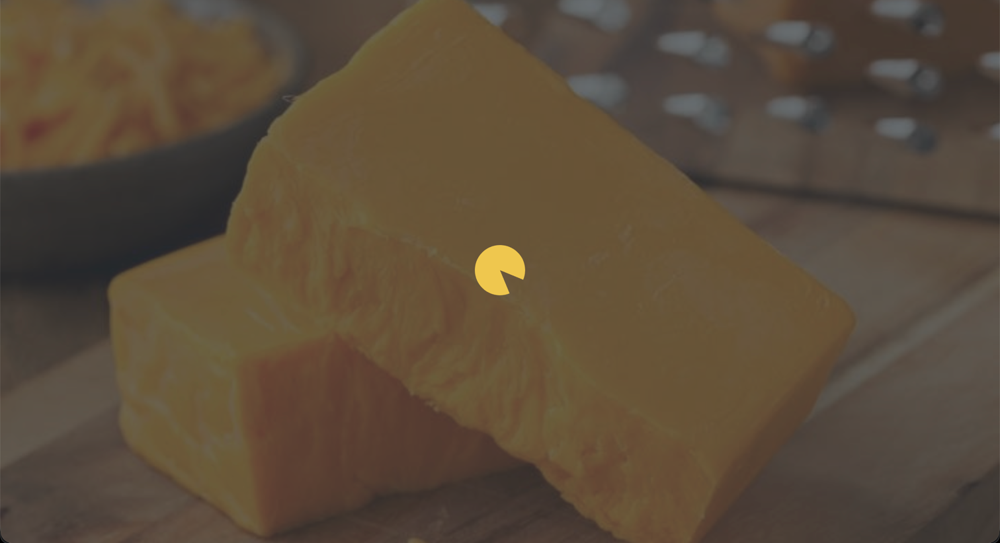
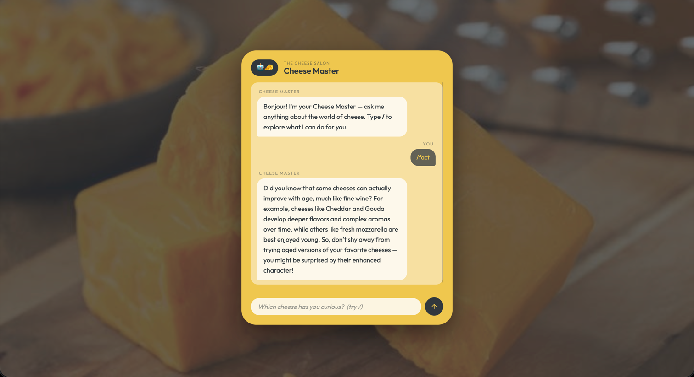

# 🤖🧀 Cheese Agent 

An AI-powered cheese chatbot with slash commands, a trivia quiz, a cheese selfie camera, and a cheddar takeover mode. Built with an Express.js backend (with Gemini & OpenAI support, plus local knowledge base fallback) and a responsive vanilla JS frontend.

|  |  |
|---|---|

---

## What it does

Chat with the Cheese Master — a knowledgeable AI affineur that answers questions about cheese using a curated database of 1,180+ artisanal cheeses from around the world. Type `/` in the chat to unlock a full command menu:

| Command | Description |
|---|---|
| `/fact` | A surprising cheese fact |
| `/pair [cheese]` | Food & wine pairings |
| `/describe [cheese]` | Evocative tasting notes |
| `/origin [cheese]` | History & provenance |
| `/substitute [cheese]` | Alternatives when you're out |
| `/board` | A curated cheese board suggestion |
| `/season` | What's at peak right now |
| `/joke` | A clever cheese joke or pun |
| `/recipe [cheese]` | A recipe starring that cheese |
| `/compare [A and B]` | Side-by-side comparison of two cheeses |
| `/country [country]` | Cheese culture and icons from any country |
| `/emoji [cheese]` | Describe a cheese using only emojis |
| `/quiz` | 5-question trivia challenge with multiple choice |
| `/cheeseme` | Take a webcam selfie and get a cheese on your head |
| `/cheddar` | Watch cheddar drip down until it consumes everything |

---

## Tech Stack

**Frontend**
- Vanilla HTML / CSS / JS — clean, responsive interface
- Interactive Canvas for webcam selfie filters and cheddar fluid effects
- Fonts: Cormorant Garamond + Outfit (Google Fonts)

**Backend**
- **Node.js (Express)** — unified server hosting static assets and handling `/chat` & `/health` API endpoints
- **AI Intelligence**:
  - **Gemini (`@google/genai`)**: Uses `gemini-2.5-flash` with grounded cheese database context
  - **OpenAI**: Compatible with `gpt-4o-mini`
  - **Local Knowledge Engine**: Instant offline fallback with 1,180+ indexed cheeses
- **Dataset**: `data/cheeses.json` containing detailed cheese origins, milk types, textures, flavor profiles, and pairings

---

## Project Structure

```
cheese-agent/
├── docs/                     # Frontend web application
│   ├── index.html            # UI, chat, slash commands, quiz, selfie, animations
│   ├── css/style.css
│   ├── js/
│   │   ├── index.js          # Cheese background rotator and entry point
│   │   ├── images.js         # List of cheese images
│   │   └── cheese_name_getter.js
│   └── src/cheese/           # Cheese background & asset images
│
├── data/
│   └── cheeses.json          # Indexed knowledge base (1,180+ cheeses)
│
├── server.js                 # Express server & AI integration (/chat, /health)
├── package.json              # NPM dependencies & scripts
├── metadata.json             # App metadata & permissions
└── .env.example              # Environment variables template
```

---

## Local Development

### 1. Clone the repository

```bash
git clone https://github.com/mariia-osipova/cheese-agent.git
cd cheese-agent
```

### 2. Install dependencies

```bash
npm install
```

### 3. Configure environment variables (Optional)

Create a `.env` file from the template:

```bash
cp .env.example .env
```

Add your Gemini API key (recommended) or OpenAI API key:

```env
GEMINI_API_KEY=your_gemini_api_key_here
```

*(Note: The server runs seamlessly even without an API key by using the built-in local cheese database engine.)*

### 4. Start the application

```bash
npm start
```

Visit **`http://localhost:3000`** in your browser.

---

## Cloud Deployment

### Option 1: Google Cloud Run (Recommended)
Deploy directly to Cloud Run using the Google Cloud CLI:

```bash
gcloud run deploy cheese-master \
  --source . \
  --port 3000 \
  --allow-unauthenticated \
  --set-env-vars GEMINI_API_KEY="your_api_key"
```

### Option 2: Render
1. Create a new **Web Service** on [Render](https://render.com) and connect your GitHub repository.
2. Configure settings:
   - **Environment**: `Node`
   - **Build Command**: `npm install`
   - **Start Command**: `npm start`
3. In **Environment Variables**, add `GEMINI_API_KEY` (or `OPENAI_API_KEY`).
4. Click **Deploy Web Service**.

### Option 3: Railway / Fly.io
1. Connect your GitHub repository to [Railway](https://railway.app) or [Fly.io](https://fly.io).
2. The Node.js `package.json` `start` script (`node server.js`) is automatically detected.
3. Add `GEMINI_API_KEY` in your service variables and launch.

---

## Environment Variables

| Variable | Required | Description |
|---|---|---|
| `GEMINI_API_KEY` | Optional | Google Gemini API key for intelligent responses |
| `OPENAI_API_KEY` | Optional | OpenAI API key (alternative model provider) |
| `OPENAI_MODEL` | Optional | OpenAI model name (defaults to `gpt-4o-mini`) |
| `PORT` | Optional | Server port (defaults to `3000`) |

---

## License & Credits

Crafted with care for cheese lovers everywhere. Features curated cheese profiles and interactive web experiences.
